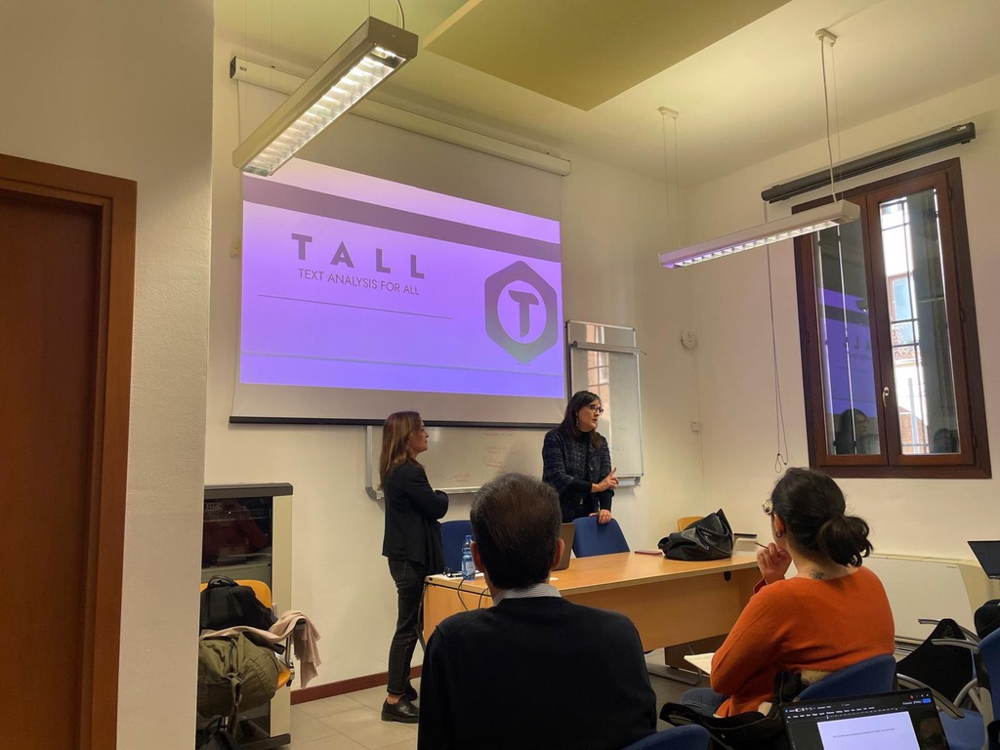
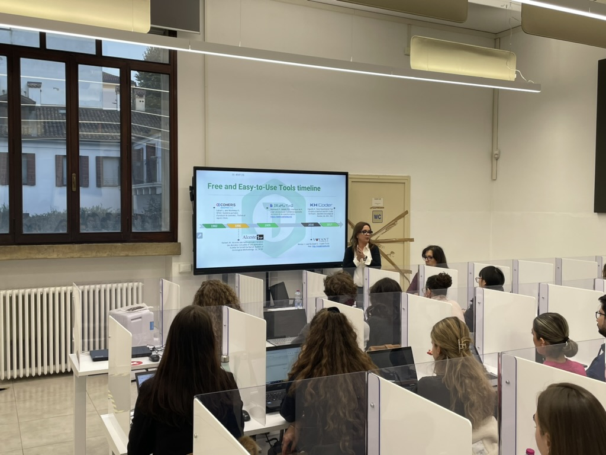
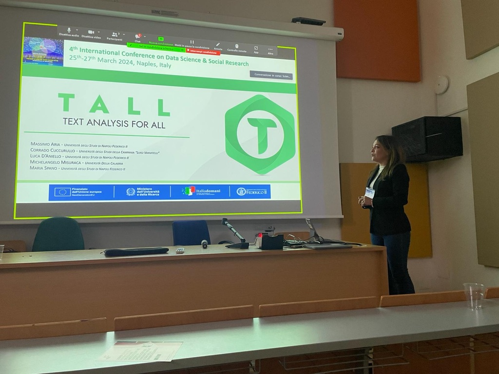
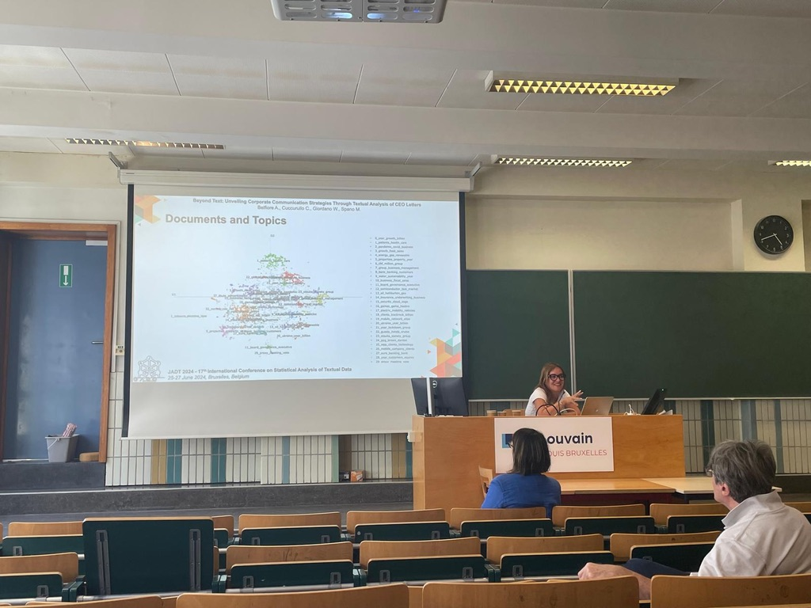

## Working Papers

- Alaimo, S. L., Aria, M., D'Aniello, L., & Spano, M. (2026). *Scientific knowledge and healthcare quality: A multidimensional assessment of Italian Academic Health Science Centres*. **Applied Stochastic Models in Business and Industry**. [forthcoming]

- Aria, M., D'Aniello, L., Misuraca, M., & Spano, M. (2026). *Rethinking thematic evolution in science mapping: An integrated framework for longitudinal analysis*. arXiv:2603.06436. [arXiv](https://arxiv.org/abs/2603.06436)

- Aria, M., D'Aniello, L., & Spano, M. (2026). *A Multi-Phase Reference Matching Algorithm for Bibliometric Analysis: Design, Implementation, and Evaluation*. [in preparation]

## Journal Articles

- Aria, M., Cuccurullo, C., D'Aniello, L., & Spano, M. (2026). *Biblioshiny and the SAAS Workflow: An integrated framework for transparent and reproducible science mapping*. **Journal of Informetrics**, 20(3), 101837.

- Aria, M., Spano, M., D'Aniello, L., Cuccurullo, C., & Misuraca, M. (2026). *TALL: Text Analysis for All – an interactive R-Shiny application for exploring, modeling, and visualizing textual data*. **SoftwareX** (Elsevier), 34, 102590.

- Misuraca, M., Spano, M., & D'Aniello, L. (2026). *ThemeScope: A quantitative thematic analysis for depicting social representations in digital arenas*. **Journal of Information Science**, 1–25.

- Aria, M., Cuccurullo, C., D'Aniello, L., & Spano, M. (2026). *SciK-Health: An open-data dashboard for the multidimensional evaluation of Italian academic health science centers*. **Quality & Quantity**, 1–30.

- Aria, M., Costanzo, D., Misuraca, M., & Spano, M. (2026). *Assessing tourism sustainability through stochastic multi-criteria acceptability analysis: Insights from the Italian regional context*. **Management Decision**, 1–18. [DOI](https://doi.org/10.1108/MD-09-2025-2815)

- Aria, M., Cuccurullo, C., D'Aniello, L., Misuraca, M., & Spano, M. (2026). *Sintetizzare la conoscenza: Un approccio integrato per l'estrazione di contenuti rilevanti nella letteratura scientifica*. **Tesi e Temi**, 1, 57–75.

- Cobo, M. J., De Mascellis, A. M., Misuraca, M., & Spano, M. (2026). *Automatic temporal framing detection for news analysis*. **Quality & Quantity**, 60(2), 5063–5085. [DOI](https://doi.org/10.1007/s11135-025-02492-1)

- Aria, M., Cuccurullo, C., D'Aniello, L., Misuraca, M., & Spano, M. (2024). *Comparative science mapping: a novel conceptual structure analysis with metadata*. **Scientometrics**, 129(11), 7055–7081. [DOI](https://doi.org/10.1007/s11192-024-05161-6)

- Misuraca, M., Spano, M., & Celardo, L. (2024). *E-wom and territorial analyses: the use of opinion mining in tourism*. **Turistica – Italian Journal of Tourism**, 33(1), 79–99.

- Celardo, L., Misuraca, M., & Spano, M. (2024). *Geo-referenced sentiment analysis for tourists' points of interest: the case of Matera European Capital of Culture*. **Rivista Italiana di Economia, Demografia e Statistica**, 78(2), 103–114.

- Del Gaudio, G., Di Taranto, E., & Spano, M. (2023). *Progress in Tourism Management: Insights for the tourism industry corporate governance*. **Corporate Ownership & Control**, 20(2), 182–195. [DOI](https://doi.org/10.22495/cocv20i2art15)

- Mele, C., Pels, J., Spano, M., & Di Bernardo, I. (2023). *Emergent understandings of the market*. **Italian Journal of Marketing**, 2023(1), 1–25.

- Blasius, J., Fabbris, L., Greenacre, M., Scepi, G., & Spano, M. (2023). *Special issue in memory of Simona Balbi*. **Italian Journal of Applied Statistics**, 35(3), 261–269.

- Mattera, R., Misuraca, M., Scepi, G., & Spano, M. (2023). *Mixed frequency composite indicators for measuring public sentiment in the EU*. **Quality & Quantity**, 57(3), 2357–2382.

- Pels, J., Mele, C., & Spano, M. (2023). *From market driving to market shaping: impact of a language shift*. **Journal of Business & Industrial Marketing**, 38(1), 155–169. [DOI](https://doi.org/10.1108/JBIM-10-2021-0503)

- D'Aniello, L., Spano, M., Cuccurullo, C., & Aria, M. (2022). *Academic Health Centers' configurations, scientific productivity, and impact: insights from the Italian setting*. **Health Policy**, 126(12), 1317–1323. [DOI](https://doi.org/10.1016/j.healthpol.2022.09.007)

- Aria, M., Cuccurullo, C., D'Aniello, L., Misuraca, M., & Spano, M. (2022). *Thematic Analysis as a new culturomic tool: the social media coverage on COVID-19 pandemic in Italy*. **Sustainability**, 14(6), 3643.

- Trinidad Segovia, J. E., Di Sciorio, F., Mattera, R., & Spano, M. (2022). *A Bibliometric Analysis on Agent‐Based Models in Finance: Identification of Community Clusters and Future Research Trends*. **Complexity**, 2022(1), 4741566. [DOI](https://dx.doi.org/10.1155/2022/4741566)

- Fedele, F., Aria, M., Esposito, V., Micillo, M., Cecere, G., Spano, M., & De Marco, G. (2022). *COVID-19 vaccine hesitancy: a survey in a population highly compliant to common vaccinations*. **Human Vaccines & Immunotherapeutics**, 17(13), 3348–3354. [DOI](https://dx.doi.org/10.1080/21645515.2021.1928460)

- Mattera, R., Misuraca, M., Scepi, G., & Spano, M. (2021). *A mixed-frequency approach for exchange rates predictions*. **Electronic Journal of Applied Statistical Analysis**, 14(1), 230–253.

- Misuraca, M., Scepi, G., & Spano, M. (2021). *Using Opinion Mining as an educational analytic: an integrated strategy for the analysis of students' feedback*. **Studies in Educational Evaluation**, 68, 100979.

- Aria, M., Misuraca, M., & Spano, M. (2020). *Mapping the evolution of social research and data science on 30 years of Social Indicators Research*. **Social Indicators Research**, 149(3), 803–831.

- Misuraca, M., Scepi, G., & Spano, M. (2020). *A network-based concept extraction for managing customer requests in a social media care context*. **International Journal of Information Management**, 51, 101956.

- Misuraca, M., Scepi, G., & Spano, M. (2020). *A bibliometric study on the evolution of Conjoint Analysis in 1998–2017*. **Italian Journal of Applied Statistics**, 32(1), 9–27.

- Matano, F., Caccavale, M., Esposito, G., Fortelli, A., Scepi, G., Spano, M., & Sacchi, M. (2020). *Integrated dataset of deformation measurements in fractured volcanic tuff and meteorological data*. **Earth System Science Data**, 12, 321–344. [DOI](https://doi.org/10.5194/essd-12-321-2020)

- Misuraca, M., Spano, M., & Balbi, S. (2019). *BMS: an improved Dunn index for Document Clustering validation*. **Communications in Statistics — Theory and Methods**, 48(20), 5036–5049.

- Balbi, S., Misuraca, M., & Spano, M. (2017). *A joint analysis of heterogeneous information on Italian listed firms*. **Italian Journal of Applied Statistics**, 29(2–3), 257–272.

- Dlova, N. C., Fabbrocini, G., Lauro, C., Spano, M., Tosti, A., & Hift, R. H. (2016). *Quality of life in South African Black women with alopecia: a pilot study*. **International Journal of Dermatology**, 55(8), 875–881. [DOI](https://doi.org/10.1111/ijd.13042)

- Ginesti, G., Macchioni, R., Sannino, G., & Spano, M. (2013). *The Impact of IASB's Guidelines for Preparing Management Commentary: Evidence from Italian Listed Firms*. **Journal of Modern Accounting and Auditing**, 9(3), 305–320.

## Books

- Cuccurullo, C., Aria, M., Spano, M., & D'Aniello, L. (2023). *Leading Change in Academic Health Science Centers*. Zaccaria srl, 1–124.

## Book Chapters

- Cozzucoli, L. A., Misuraca, M., & Spano, M. (2026). *Evaluating the Impact of Government Orientation on the Adoption of AI in Business: A Causal Inference Study*. In F. Greco, A. Fronzetti Colladon, P. A. Gloor (Eds.), *Artificial Intelligence and Networks for a Sustainable Future: Connecting Species*, Springer, Cham. [in press]

- Spano, M., Misuraca, M., & Celardo, L. (2025). *From Vectors to Networks: Comparing Conventional and Graph-Based Approaches to Unsupervised Text Categorisation*. In A. D'Ambrosio et al. (Eds.), *Supervised and Unsupervised Statistical Data Analysis*, Springer, Cham, pp. 304–315.

- De Mascellis, A. M., Misuraca, M., Scepi, G., & Spano, M. (2025). *An automatic framing approach to analyse newspaper and press language*. In XXX (Eds.), *Data Science and Social Research IV*, Springer, Cham. [in press]

- Misuraca, M., Scepi, G., & Spano, M. (2023). *Network-based dimensionality reduction for textual datasets*. In E. Brentari, M. Chiodi, E.-J. C. Wit (Eds.), *Models for Data Analysis*, Springer, Cham, pp. 175–190.

- Misuraca, M., & Spano, M. (2020). *Unsupervised analytic strategies to explore large document collections*. In D. F. Iezzi, D. Mayaffre, M. Misuraca (Eds.), *Text Analytics. Advances and Challenges*, Springer, Heidelberg, pp. 17–28.

- Stawinoga, A., Spano, M., & Triunfo, N. (2016). *Extracting meta-information by using Network Analysis tools*. In G. Alleva, A. Giommi (Eds.), *Studies in Theoretical and Applied Statistics*, Springer, pp. 101–109. [DOI](https://doi.org/10.1007/978-3-319-27274-0_9)

## Conference Proceedings

- Aria, M., Cuccurullo, C., D'Aniello, L., Spano, M., & Alabiso, C. (2025). *From data collection to knowledge in health: Turning scientific production into practical decision-making tools*. In G. Boccuzzo et al. (Eds.), *IES 2025 – Statistics and Data Science for Evaluation and Quality*, Cleup, Padova. ISBN: 978-88-5495-849-4.

- Gnasso, A., Sacco, D., Celardo, L., Smecca, M. A., Alabiso, C., & Spano, M. (2025). *Research excellence and patient perception: investigating the impact of AHSCs' scientific output*. In G. Boccuzzo et al. (Eds.), *IES 2025*, Cleup, Padova. ISBN: 978-88-5495-849-4.

- Aria, M., Cuccurullo, C., D'Aniello, L., Misuraca, M., & Spano, M. (2025). *Keyword-enhanced summarization from scientific literature through an integrated approach*. In L. S. Alaimo et al. (Eds.), *ASA 2024 – Statistics, Technology and Data Science for Economic and Social Development*, Firenze University Press, pp. 37–43. [DOI](https://doi.org/10.26398/asaproc.0076)

- Belfiore, A., Spano, M., Cuccurullo, C., & Giordano, W. (2024). *Beyond Text: Unveiling Corporate Communication Strategies Through Textual Analysis of CEO Letters*. In A. Dister, D. Longrée (Eds.), *JADT24*, Presses Universitaires De Louvain, Vol. 1, pp. 69–78. ISBN: 978-2-39061-471-5.

- Aria, M., Cuccurullo, C., D'Aniello, L., Misuraca, M., & Spano, M. (2024). *Breaking barriers with TALL: a text analysis Shiny app for all*. In A. Dister, D. Longrée (Eds.), *JADT24*, Presses Universitaires De Louvain, Vol. 1, pp. 39–48. ISBN: 978-2-39061-471-5.

- Celardo, L., Misuraca, M., & Spano, M. (2024). *See Naples, then dye: Spatial Categorisation of Tourist Attractions with Reviews' Sentiment Scores*. In A. Dister, D. Longrée (Eds.), *JADT24*, Presses Universitaires De Louvain, Vol. 1, pp. 189–198. ISBN: 978-2-39061-471-5.

- D'Aniello, L., Aria, M., Cuccurullo, C., Misuraca, M., & Spano, M. (2024). *Extracting knowledge from scientific literature with an integrated text summarization approach*. In A. Dister, D. Longrée (Eds.), *JADT24*, Presses Universitaires De Louvain, Vol. 1, pp. 239–248. ISBN: 978-2-39061-471-5.

- Costanzo, G. D., Dattilo, B., Di Torrice, M., Misuraca, M., & Spano, M. (2024). *Measuring Sustainability in Tourism via a Multi-Criteria Decision Making approach*. In A. Pollice, P. Mariani (Eds.), *SIS 2024*, Springer Nature, pp. 513–518.

- Aria, M., Cuccurullo, C., D'Aniello, L., Misuraca, M., & Spano, M. (2024). *TALL: A new Shiny app for Text Analysis*. In A. Pollice, P. Mariani (Eds.), *SIS 2024*, Springer Nature, pp. 64–70.

- Celardo, L., Misuraca, M., & Spano, M. (2024). *Spatial sentiment analysis of tourist points of interest*. In *AIQUAV 2023*, UniBa, pp. 1–6.

- Aria, M., Cuccurullo, C., D'Aniello, L., Misuraca, M., & Spano, M. (2023). *TAll: a new Shiny app of Text Analysis for All*. In F. Boschetti et al. (Eds.), *CLiC-it 2023*, CEUR Workshop Proceedings, Vol. 3596, pp. 1–4.

- Celardo, L., Misuraca, M., & Spano, M. (2023). *Georeferencing sentiment scores to map and explore tourist points of interest*. In R. Martínez-Torres, S. Toral (Eds.), *CARMA 2023*, Editorial UPV, pp. 115–122.

- Aria, M., Cuccurullo, C., D'Aniello, L., Misuraca, M., & Spano, M. (2022). *Text Summarization of a scientific document: a comparison of extractive unsupervised methods*. In M. Misuraca, G. Scepi, M. Spano (Eds.), *JADT2022*, VADISTAT Press, Napoli, pp. 67–73.

- Cobo, M. J., & Spano, M. (2022). *An automatic approach for bibliographical co-words networks labelling*. In *SIS 2022*, Pearson, pp. 773–779.

- Basile, V., Misuraca, M., & Spano, M. (2022). *Thematic analysis on online education issues during COVID-19*. In *SIS 2022*, Pearson, pp. 437–445.

- Belfiore, A., Spano, M., Mandenaki, K., & Giordano, W. (2022). *Exploring companies' communication strategies in the Covid-19 era*. In M. Misuraca, G. Scepi, M. Spano (Eds.), *JADT2022*, VADISTAT Press, Napoli.

- Ferracci, M., Scepi, G., Spano, M., & Misuraca, M. (2022). *Nodi discorsivi e processi di progettazione condivisa: Milano e Torino*. In M. Misuraca, G. Scepi, M. Spano (Eds.), *JADT2022*, VADISTAT Press, Napoli, pp. 400–407.

- Mattera, R., Misuraca, M., Scepi, G., & Spano, M. (2022). *Clustering of financial time series: a bibliometric analysis*. In M. Misuraca, G. Scepi, M. Spano (Eds.), *JADT2022*, VADISTAT Press, Napoli, pp. 584–590.

- Aria, M., Cuccurullo, C., D'Aniello, L., & Spano, M. (2022). *Thematic evolution of Academic Medical Centers' research: a focus on Italian public owned AOUs in metropolitan areas*. In *IES 2022*, Vol. 1, pp. 67–72. ISBN: 978-88-94593-35-8.

- Cuccurullo, C., D'Aniello, L., Aria, M., & Spano, M. (2021). *Measuring the impact of healthcare indicators on academic medical centers' scientific production*. In *ASA 2021*, Firenze University Press, Vol. 132, pp. 160–165.

- Cuccurullo, C., D'Aniello, L., & Spano, M. (2021). *Thematic atlas of Italian oncological research: the analysis of public IRCCS*. In *ASA 2021*, Firenze University Press, Vol. 127, pp. 109–114. [DOI](https://doi.org/10.36253/978-88-5518-304-8.22)

- Misuraca, M., Scepi, G., & Spano, M. (2021). *A comparative study on community detection and clustering algorithms for text categorisation*. In *JADT2020* [online].

- Carannante, M., Mattera, R., Scepi, G., Misuraca, M., & Spano, M. (2020). *Nowcasting GDP using mixed-frequency based composite confidence indicators*. In *SIS 2020*, Pearson, pp. 981–986.

- Forciniti, A., Misuraca, M., Scepi, G., & Spano, M. (2019). *Generalized Procrustes Analysis for Multilingual Studies*. In *SIS 2019*, Pearson, pp. 879–884.

- Scepi, G., Misuraca, M., Spano, M., Carannante, M., & Mattera, R. (2019). *Temporal sentiment analysis with distributed lag models*. In *SIS 2019*, Pearson, pp. 149–156.

- Misuraca, M., Scepi, G., & Spano, M. (2018). *A network approach to dimensionality reduction in Text Mining*. In *SIS 2018*, Pearson, pp. 344–351.

- Balbi, S., Misuraca, M., & Spano, M. (2018). *A two-step strategy for improving categorisation of short texts*. In *JADT2018*, UniversItalia, Roma, Vol. 1, pp. 60–67.

- Balbi, S., Misuraca, M., & Spano, M. (2016). *A cosine-based validation index for Document Clustering*. In *JADT2016*, Presses Fac Imprimeur, Nice, Vol. 1, pp. 65–74.

- Misuraca, M., & Spano, M. (2013). *Comparing text clustering algorithms from a multivariate perspective*. In *CLADAG 2013*, CLEUP, Padova, pp. 331–334.

- Stawinoga, A., Spano, M., & Triunfo, N. (2012). *Extracting meta-information by using Network Analysis tools*. In *46th SIS Meeting*, Roma (invited session). ISBN: 978-88-6129-882-8.

- Ginesti, G., Maffei, M., Spano, M., & Triunfo, N. (2012). *A textual processing approach for analysing the narrative disclosures in corporate reports*. *AMIS 2012*. ISSN: 2247-6245.

- Spano, M., & Triunfo, N. (2012). *La relazione sulla gestione delle società italiane quotate sul mercato regolamentato*. *JADT 2012*. ISBN: 978-2-9601246-0-6.

## Technical Reports & Software

- Misuraca, M., Forciniti, A., Scepi, G., & Spano, M. (2020). *Sentiment Analysis for Education with R: packages, methods and practical applications*. arXiv:2005.12840. [arXiv](https://arxiv.org/abs/2005.12840)

- Aria, M., Cuccurullo, C., D'Aniello, L., Misuraca, M., & Spano, M. (2023). **TALL: Text Analysis for All** — R/Shiny application. CRAN. [cran.r-project.org/package=tall](https://cran.r-project.org/web/packages/tall/index.html)

## From Conference

::: {.row}
::: {.col-md-7}

I regularly participate in national and international conferences on **text mining**, **data science**, and **statistical analysis of textual data**. Since 2024 I am a permanent member of the Scientific Committee of JADT. In 2022, I co-chaired the 16th JADT International Conference held in Naples.

:::

::: {.col-md-5}

<a href="images/pub3.jpg" data-lightbox="conference">
  
  
Teaching at University of Padova

</a>

<a href="images/pub2.jpeg" data-lightbox="conference">
  
  
TALL session

</a>

<a href="images/pub4.jpeg" data-lightbox="conference">
  
  
Data Science and Social Research Conference

</a>

<a href="images/publ.jpeg" data-lightbox="conference">
  
  
JADT 2024 – Université Saint-Louis Bruxelles

</a>

:::
:::
